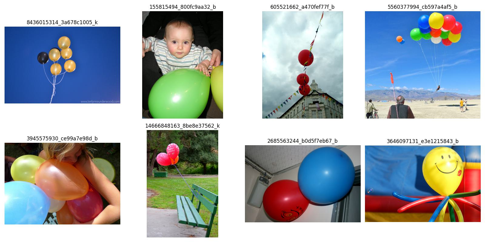
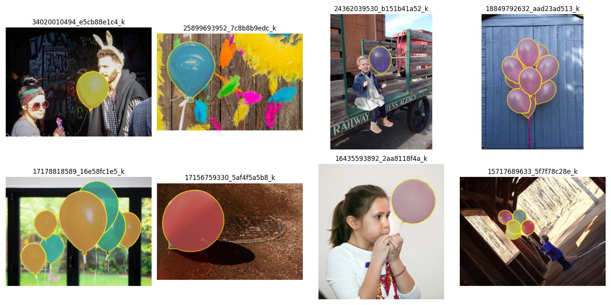
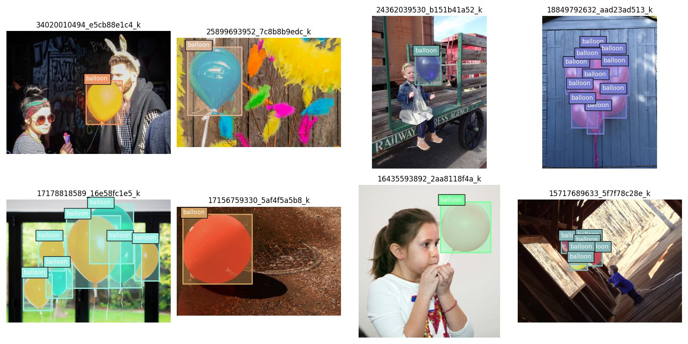

# HW3 mmdet

## tasks
基于 RTMDet 的气球检测

- 基于提供的 notebook，将 cat 数据集换成气球数据集
- 按照视频中 notebook 步骤，可视化数据集和标签
- 使用MMDetection算法库，训练 RTMDet 气球目标检测算法，可以适当调参，提交测试集评估指标
- 用网上下载的任意包括气球的图片进行预测，将预测结果发到群里
- 按照视频中 notebook 步骤，对 demo 图片进行特征图可视化和 Box AM 可视化，将结果发到群里

### requirements
- 需提交的测试集评估指标（不能低于baseline指标的50%）
- 目标检测 RTMDet-tiny 模型性能不能低于 65 mAP

### 数据集
- 气球数据集可以直接下载 https://download.openmmlab.com/mmyolo/data/balloon_dataset.zip

### 同时也欢迎各位选择更复杂的数据集进行训练，可以选用一下 10 类的饮料数据集。
- https://github.com/TommyZihao/Train_Custom_Dataset/tree/main/%E7%9B%AE%E6%A0%87%E6%A3%80%E6%B5%8B/%E7%9B%AE%E6%A0%87%E6%A3%80%E6%B5%8B%E6%95%B0%E6%8D%AE%E9%9B%86

## results

### visualization

- 处理数据集: [mmdet_proc_dataset.ipynb](./mmdet_proc_dataset.ipynb)
    - 主要是可视化

- 训练模型: [mmdet_RTMDet.ipynb](./mmdet_RTMDet.ipynb)

- 测试模型: [mmdet_test.ipynb](./mmdet_test.ipynb)

- 结果:

