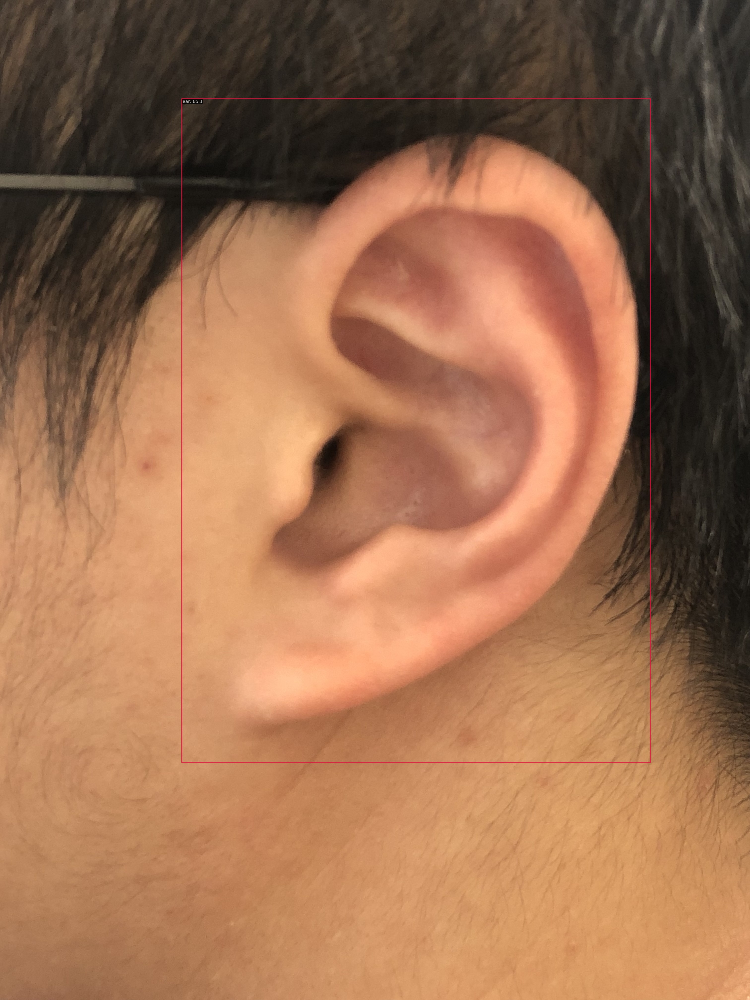
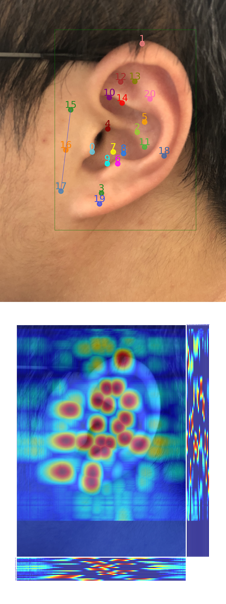

# HW1: MMPose

## MMDection

- 使用MMDetection算法库，训练RTMDet耳朵目标检测算法，提交测试集评估指标;
- [notebook](./MMDet_RTMDet.ipynb)
- [workdir](./MMDet_RTMDet)

```text
 Average Precision  (AP) @[ IoU=0.50:0.95 | area=   all | maxDets=100 ] = 0.821
 Average Precision  (AP) @[ IoU=0.50      | area=   all | maxDets=100 ] = 0.964
 Average Precision  (AP) @[ IoU=0.75      | area=   all | maxDets=100 ] = 0.964
 Average Precision  (AP) @[ IoU=0.50:0.95 | area= small | maxDets=100 ] = -1.000
 Average Precision  (AP) @[ IoU=0.50:0.95 | area=medium | maxDets=100 ] = -1.000
 Average Precision  (AP) @[ IoU=0.50:0.95 | area= large | maxDets=100 ] = 0.821
 Average Recall     (AR) @[ IoU=0.50:0.95 | area=   all | maxDets=  1 ] = 0.857
 Average Recall     (AR) @[ IoU=0.50:0.95 | area=   all | maxDets= 10 ] = 0.857
 Average Recall     (AR) @[ IoU=0.50:0.95 | area=   all | maxDets=100 ] = 0.857
 Average Recall     (AR) @[ IoU=0.50:0.95 | area= small | maxDets=100 ] = -1.000
 Average Recall     (AR) @[ IoU=0.50:0.95 | area=medium | maxDets=100 ] = -1.000
 Average Recall     (AR) @[ IoU=0.50:0.95 | area= large | maxDets=100 ] = 0.857
06/04 22:13:00 - mmengine - INFO - bbox_mAP_copypaste: 0.821 0.964 0.964 -1.000 -1.000 0.821
06/04 22:13:00 - mmengine - INFO - Epoch(test) [6/6]    coco/bbox_mAP: 0.8210  coco/bbox_mAP_50: 0.9640  coco/bbox_mAP_75: 0.9640  coco/bbox_mAP_s: -1.0000  coco/bbox_mAP_m: -1.0000  coco/bbox_mAP_l: 0.8210  data_time: 3.0053  time: 3.6121
```

## MMPose

- 使用MMPose算法库，训练RTMPose耳朵关键点检测算法，提交测试集评估指标;
- [notebook](./MMPose_RTMPose.ipynb)
- [workdir](./MMPose_RTMPose)

```text
 Average Precision  (AP) @[ IoU=0.50:0.95 | area=   all | maxDets= 20 ] =  0.733
 Average Precision  (AP) @[ IoU=0.50      | area=   all | maxDets= 20 ] =  1.000
 Average Precision  (AP) @[ IoU=0.75      | area=   all | maxDets= 20 ] =  0.946
 Average Precision  (AP) @[ IoU=0.50:0.95 | area=medium | maxDets= 20 ] = -1.000
 Average Precision  (AP) @[ IoU=0.50:0.95 | area= large | maxDets= 20 ] =  0.733
 Average Recall     (AR) @[ IoU=0.50:0.95 | area=   all | maxDets= 20 ] =  0.774
 Average Recall     (AR) @[ IoU=0.50      | area=   all | maxDets= 20 ] =  1.000
 Average Recall     (AR) @[ IoU=0.75      | area=   all | maxDets= 20 ] =  0.952
 Average Recall     (AR) @[ IoU=0.50:0.95 | area=medium | maxDets= 20 ] = -1.000
 Average Recall     (AR) @[ IoU=0.50:0.95 | area= large | maxDets= 20 ] =  0.774
06/04 22:50:24 - mmengine - INFO - Evaluating PCKAccuracy (normalized by ``"bbox_size"``)...
06/04 22:50:24 - mmengine - INFO - Evaluating AUC...
06/04 22:50:24 - mmengine - INFO - Evaluating NME...
06/04 22:50:24 - mmengine - INFO - Epoch(test) [6/6]    coco/AP: 0.732748  coco/AP .5: 1.000000  coco/AP .75: 0.946390  coco/AP (M): -1.000000  coco/AP (L): 0.732748  coco/AR: 0.773810  coco/AR .5: 1.000000  coco/AR .75: 0.952381  coco/AR (M): -1.000000  coco/AR (L): 0.773810  PCK: 0.973923  AUC: 0.134637  NME: 0.042401  data_time: 1.621584  time: 2.148609
```

## photo inference

- 用自己耳朵的图像预测，将预测结果发到群里;

**MMDet result**: `ear 85.1`



**MMPose result**:



## video inference

- 用自己耳朵的视频预测，将预测结果发到群里;
    - 跳过了, 视频有点大不想放到github上


