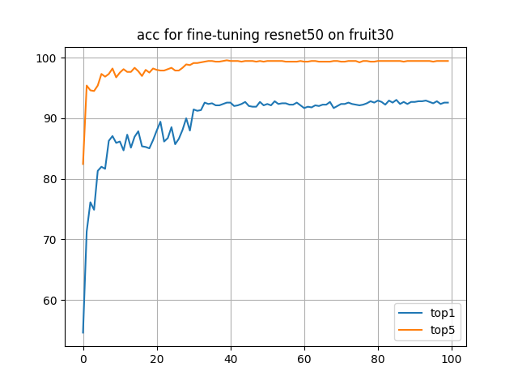
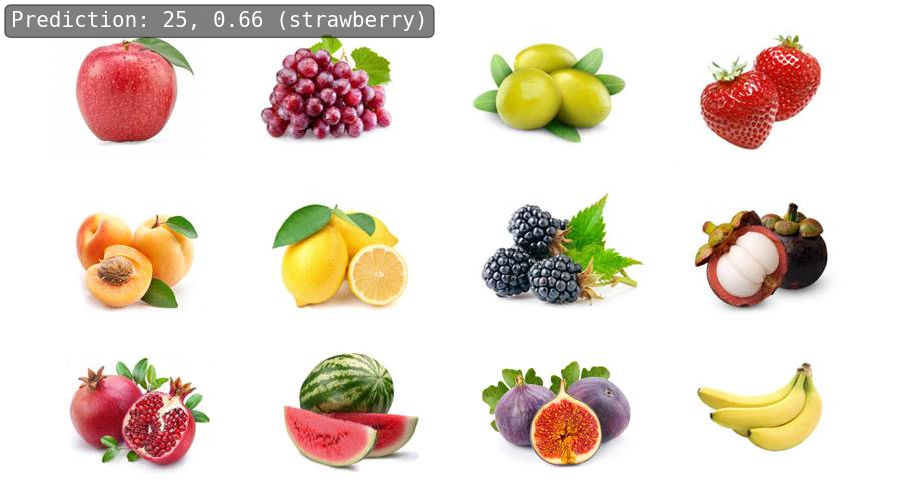
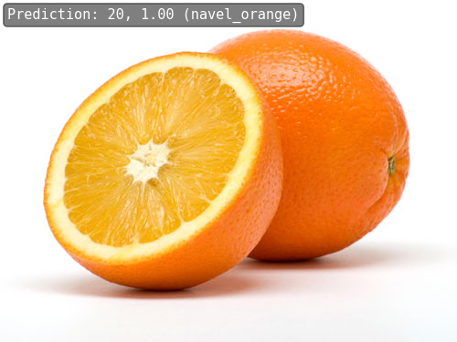

# HW2

resnet50 on fruit30 dataset


## tasks

- 划分训练集和验证集；
    - see [fruit_proc_data.ipynb](fruit_proc_data.ipynb)
- 按照 MMPreTrain CustomDataset 格式组织训练集和验证集；
    - finished in the last step
- 使用 MMPreTrain 算法库，编写配置文件，正确加载预训练模型；
    - see [resnet50_8xb32_fruit30.py](resnet50_8xb32_fruit30.py)
- 在水果数据集上进行微调训练；
    - see [fruit_train_model.ipynb](fruit_train_model.ipynb)
- 使用 MMPreTrain 的 ImageClassificationInferencer 接口，对网络水果图像，或自己拍摄的水果图像，使用训练好的模型进行分类。
    - see [fruit_inference.ipynb](fruit_inference.ipynb)


## results

- acc
```text
2023/06/09 15:43:24 - mmengine - INFO - Epoch(test) [28/28]    accuracy/top1: 93.0180  accuracy/top5: 99.4369  data_time: 0.1353  time: 0.2307
```


- inference



